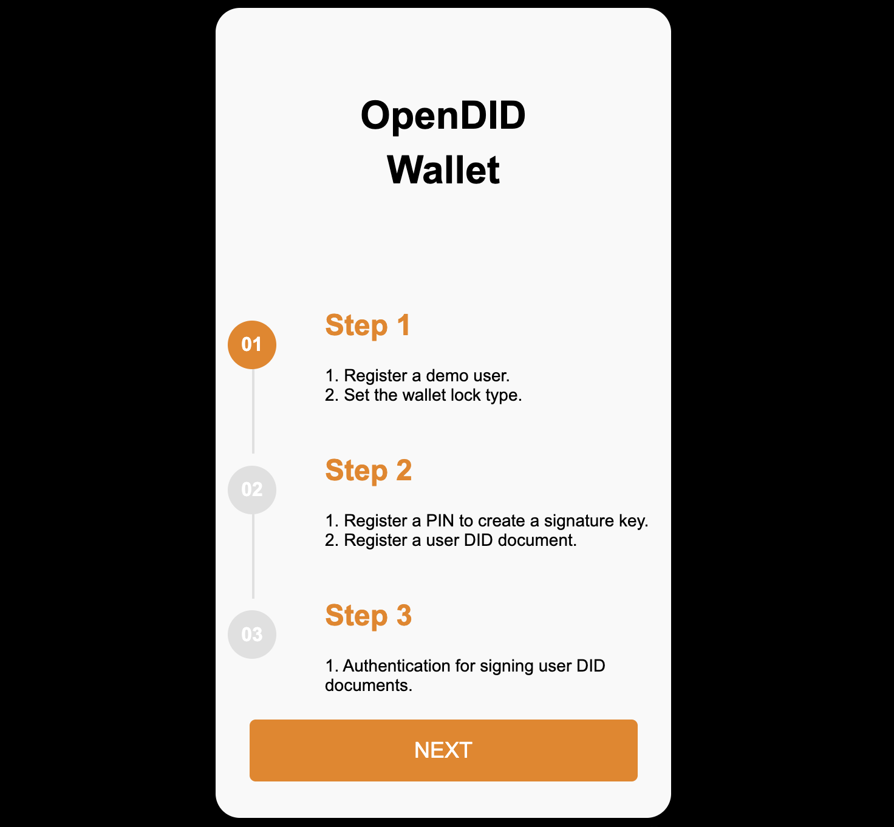
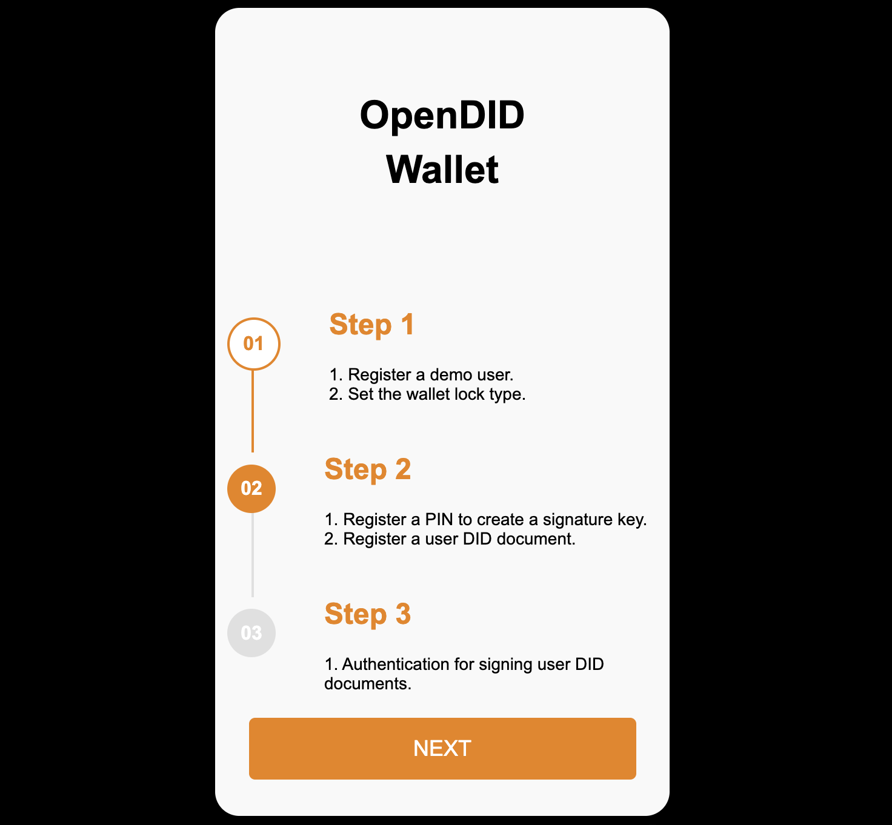
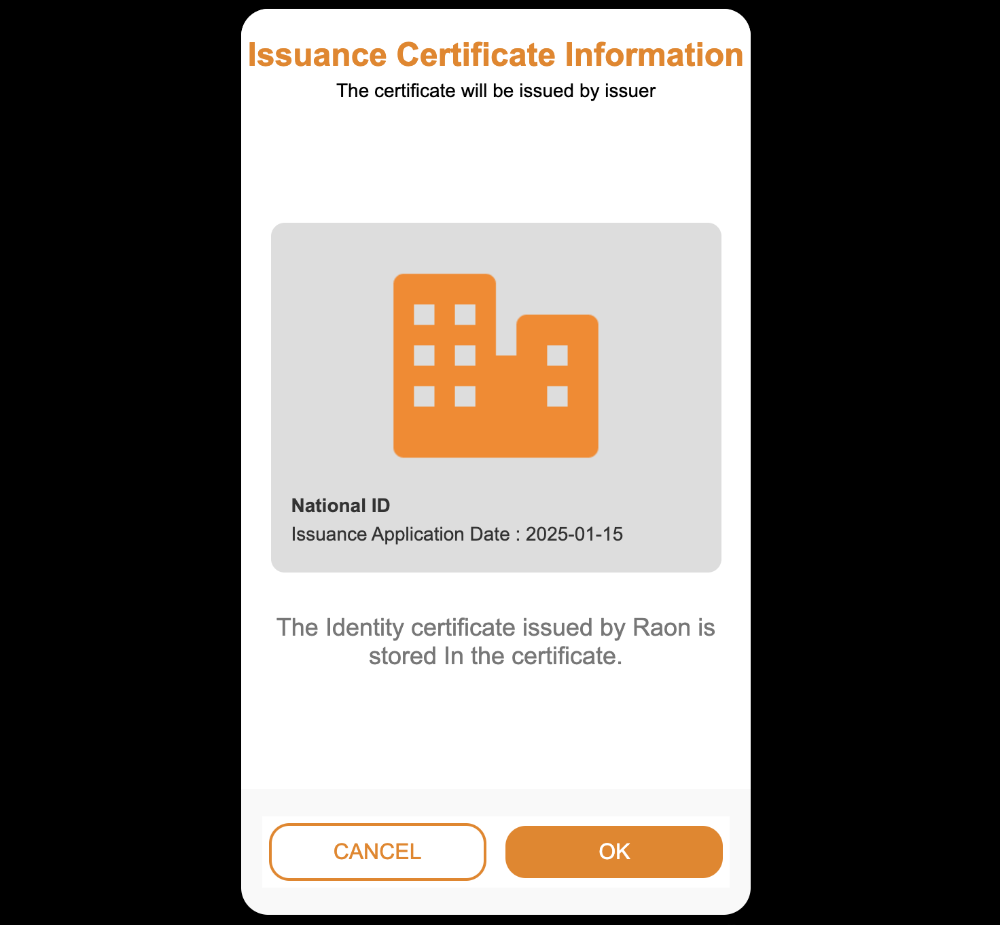
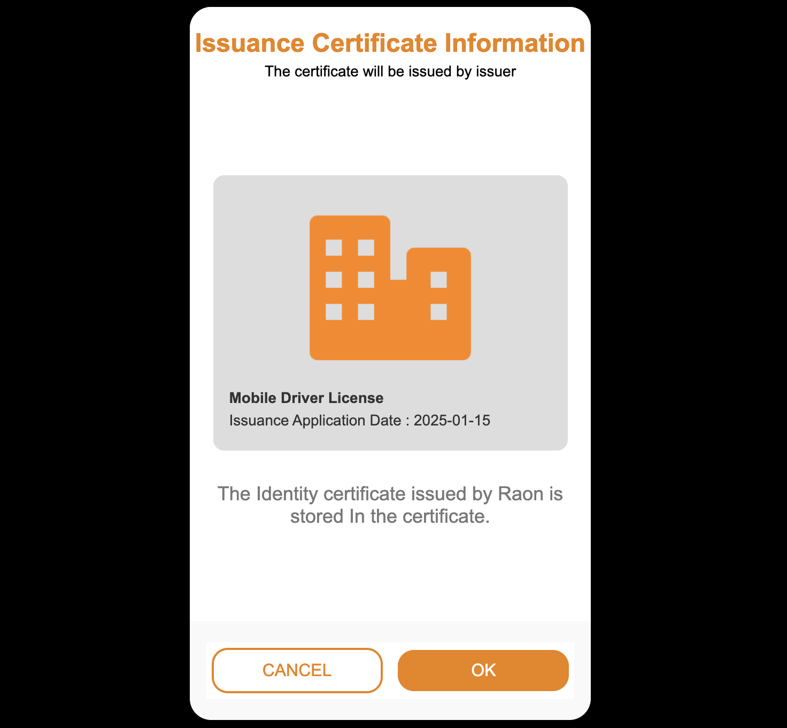
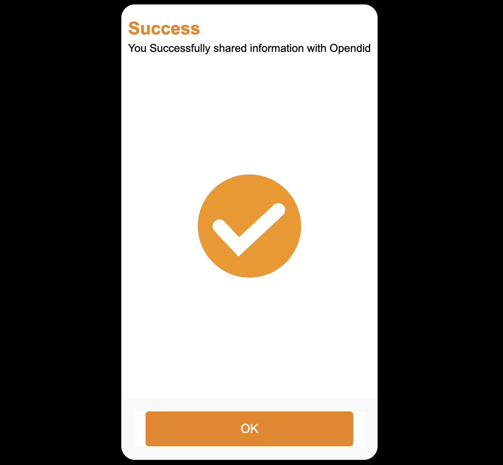
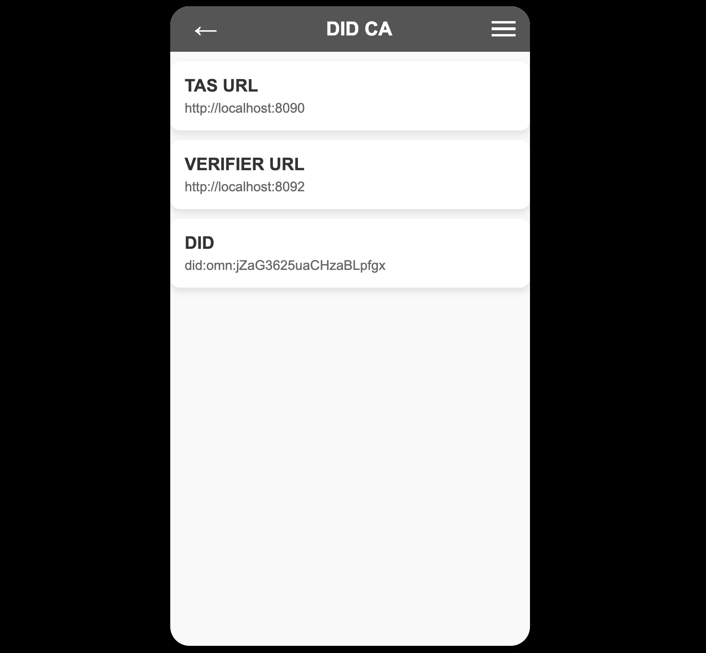

# Demo App Guide (V1.0.0.0)

## step1

- The 'Open DID Wallet' screen appears, guiding the user through the registration process step by step.  
- Confirm that Step 1 is in progress, then click the `NEXT` button.  
- Step 1 involves entering the user's information and setting the wallet's lock type.  

## user_info

- The 'User Information' screen appears where the user inputs their details.  
- Fields include `First Name` and `Last Name`, which are used for:  
  - Generating the user's PII with salt.  
  - Displaying user info when showing issued VCs in the app.  

## lock_popup

- This is the wallet lock type setup screen, which is not supported in this demo.  

## step2

- Confirm that Step 2 is in progress, then click the `NEXT` button.  
- Step 2 involves generating a DID Document and registering an authentication method.  

## pin_registration

- Register a 6-digit PIN to be used as an authentication method for signing.  
- Once registered, the user's DID Document will be created.  

## finger_popup

- A popup asks whether to register the user's fingerprint for signing.  
- Only PIN registration is supported in this demo.  

## step3

- Confirm that Step 3 is in progress, then click the `NEXT` button.  
- Step 3 involves signing and registering the user's DID Document.  

## pin_authentication

- Enter the 6-digit PIN to sign and register the user's DID Document.  

## main

- After initial registration, if no VC has been issued, the message `"No certificate has been issued."` is shown.  

- If VCs have been issued, they are displayed in a list.  

- Two buttons are available at the bottom:  
  - ADD VC: Issues a VC via User Initiated method.  
  - SCAN QR: Scans a QR code for VC issuance or VP submission via Issuer Initiated method.  

- This demo supports issuing two types of VCs:  
  - National ID: User Initiated  
  - mDL (Mobile Driving License): Issuer Initiated  

## add_vc

- To issue a VC, select `National ID Plan` from the available list.  

## scan_qr_vc

- Scan a QR code to issue a VC.  
- In this demo, the scan screen is shown without performing an actual scan.  

## issue_profile

- Confirm information such as issuer, VC name, and issuance date.  

## vc_info

- Enter the following information to proceed with issuance:  
  - Birthdate  
  - Address  
  - License Number  
  - Issue Date  

## vc_authentication

- Enter the previously set PIN.  

## issue_result

- Confirmation message is shown after the VC is issued.  

## scan_qr_vp

- Scan a QR code to submit a VP.  
- In this demo, the scan screen is shown without performing an actual scan.  

## verify_profile

- Confirm the claim information to be submitted.  

## vp_authentication

- Enter the previously set PIN.  

## verify_result

- Confirmation message is shown after VP submission is completed.  

## detail_mdl

- View detailed information of the issued mDL.  

## detail_nid

- View detailed information of the issued National ID.  

## issue_result

- Confirmation message is shown after the VC is issued.  

## settings

- Displays the URLs of TAS and Verifier. Random values are shown in this demo.  
- After the user's DID Document is created, the DID can be checked here.  
