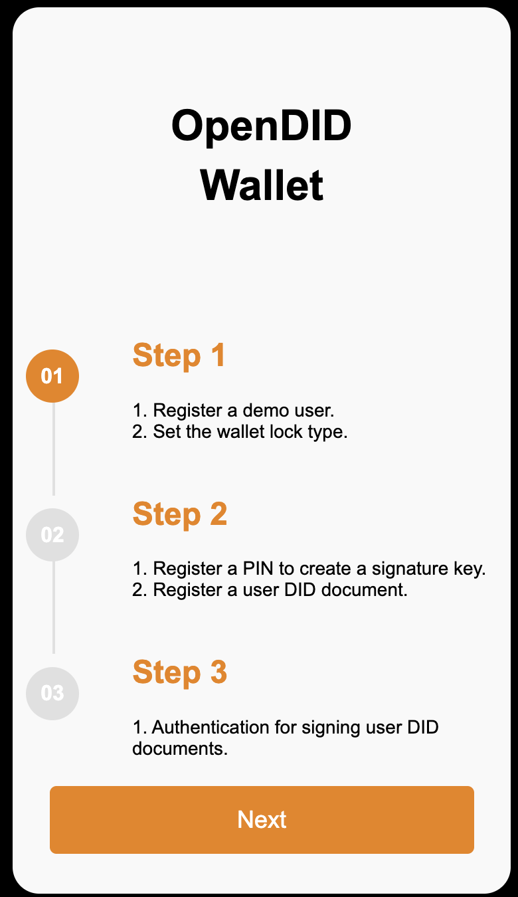
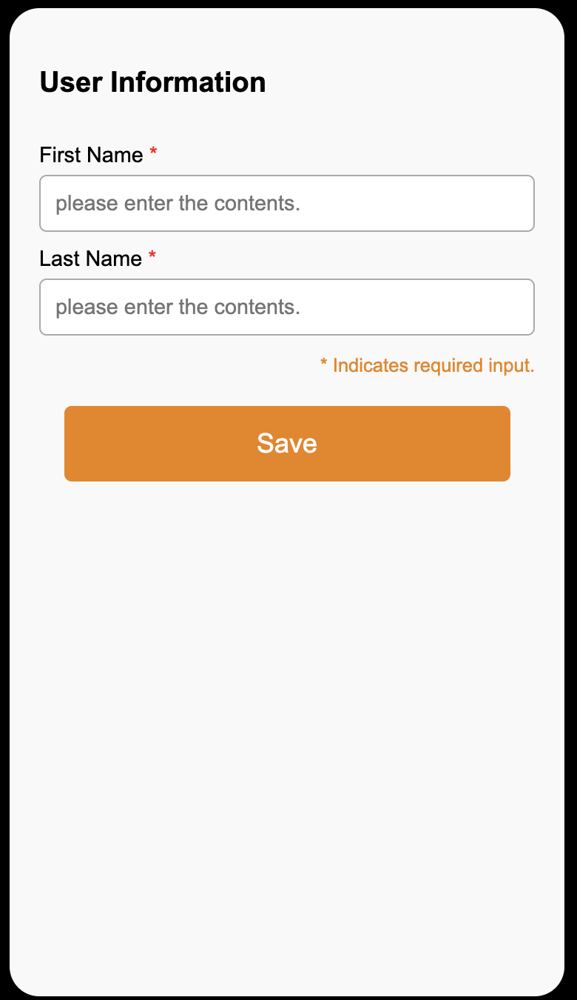

# Demo App 가이드 (V1.0.0.0)

## step1
   

- Open DID Wallet' 화면이 나타나며, 사용자의 등록 과정을 단계별로 안내해 줍니다. 현재 Step 1을 진행 중임을 확인하고, `Next` 버튼을 클릭합니다.

## user_info

- 'User Information' 화면이 나타나며 사용자의 정보를 입력하게 됩니다. 입력 항목은 `First Name` 과 `Last Name`이며, 아래와 같은 용도로 사용됩니다:
   - 사용자의 PII를 생성할 때 salt로 사용됩니다.
   - 앱에서 발급받은 VC를 화면에 표시할 때, 사용자의 정보로 출력됩니다.

5. 사용자의 정보를 입력하고 `Save` 버튼을 클릭합니다.
   
6. 'Would you like to set the Wallet for lock type?' 라는 문구의 팝업이 화면에 나타나며, 월렛을 잠금 모드로 설정할지 물어봅니다. 여기에서는 `YES` 버튼을 클릭합니다.

7. 'Please register a Lock/Unlock PIN' 문구가 표시되며 월렛 잠금 비밀번호를 입력하는 화면이 나타납니다. 6자리의 숫자를 입력하며, 확인을 위해 한 번 더 동일한 6자리 숫자를 입력합니다.

8. 'User Information' 화면이 나타나며 현재 Step 2가 진행 중임을 확인합니다. `Next` 버튼을 클릭합니다.

9. 'Please register a PIN' 문구가 표시되며 PIN을 등록하는 화면이 나타납니다. 6자리의 숫자를 입력하며, 확인을 위해 한 번 더 동일한 6자리 숫자를 입력합니다.

10. 'Would you like to register additional fingerprints?' 문구의 팝업이 화면에 나타나며, 추가로 지문을 등록할지 물어보니다. 여기에서는 `YES` 버튼을 클릭합니다.

11. 'please input a Lock/Unlock PIN' 문구가 표시되며 PIN을 확인하는 화면이 나타납니다. 6자리의 숫자를 입력하며, 확인을 위해 한 번 더 동일한 6자리 숫자를 입력합니다.

12. 앱 OS에서 지문을 입력하는 팝업이 나타납니다. 지문을 입력하여 등록합니다.
   
13. 'User Information' 화면이 나타나며 현재 Step 3가 진행 중임을 확인합니다. `Next` 버튼을 클릭합니다.

14. 'Please input a PIN' 문구가 표시되며 PIN 키를 입력하는 화면이 나타납니다. 6자리의 숫자를 입력합니다.

15. 앱 OS에서 지문을 입력하는 팝업이 나타납니다. 지문을 입력합니다.

16. 메인 페이지로 이동한 후, 아직 등록된 VC가 없음을 확인합니다. 화면에는 'No certificate has been issued.'라는 문구가 출력됩니다.
   

 

## 6.2. VC 발급 테스트

### 6.2.1. MDL(Mobile Driver License) VC 발급 테스트

1. 웹 브라우저에서 데모 서버의 메인 페이지에 접속합니다. (http://192.168.1.1:8099/home)

2. `Enter Information` 버튼을 클릭합니다.
   - `User Information`에 [6.1사용자 등록 단계](#61-사용자-등록-테스트)에서 입력한 정보와 동일하게 입력합니다.
     - 동일한 정보를 입력하지 않을 경우 MDL VC발급에 실패합니다.
   - `Identification information` 정보를 입력합니다.

3. `Save` 버튼을 클릭해 사용자 정보를 저장합니다.
   - 저장된 데이터는 MDL VC 발급에 사용되며, 다음번 테스트에는 해당 과정을 생략해도 됩니다.

4. `VC issuance` 버튼을 클릭합니다.

5. `Issuance of ID card` 버튼을 클릭합니다.
6. 'Issue with QR' 팝업이 나타나며 화면에 QR 코드가 표시됩니다.

7.  `DID CA` 앱을 실행합니다.
8.  월렛이 잠금 모드로 설정되어 있는 경우, PIN 입력 화면이 나타납니다. 잠금을 해제하기 위해 6자리의 숫자를 입력합니다.
   

9.  화면 하단의 `SCAN QR` 버튼을 클릭합니다.

10.  휴대폰의 카메라 화면이 활성화되면, QR 코드를 스캔합니다. 
11. 'Issuance certificate Information' 화면이 나타나며 발급받을 VC에 대한 정보가 출력됩니다. `OK` 버튼을 클릭합니다.

12. 지문 인증 또는 'Please input a PIN' 문구가 표시되며 PIN 키를 입력하는 화면이 나타나며, 사용자 인증을 진행합니다.
  
13. 'Success" 문구가 표시되며 VC가 발급 성공했음을 확인합니다. `OK` 버튼을 클릭합니다.

14.  메인 페이지로 이동한 후, 등록한 MDL VC가 화면에 표시된 것을 확인합니다. 

15.  해당 MDL VC를 클릭으로 상세 클레임 정보를 확인할 수 있습니다.

16. 데모 서버의 'Issue with QR' 팝업에서 `Check issuance` 버튼을 클릭합니다.
17. 'Mobile ID Issued Successfully' Alert 창이 나타납니다. `확인` 버튼을 클릭합니다.
18. 'The issuance of the mobile ID has been completed.' 문구가 팝업에 표시되며 MDL VC 발급이 성공적으로 완료되었음을 확인합니다.

 

### 6.2.2. National ID VC 발급 테스트

1. `DID CA` 앱을 실행합니다.
2. 월렛이 잠금 모드로 설정되어 있는 경우, PIN 입력 화면이 나타납니다. 잠금을 해제하기 위해 6자리의 숫자를 입력합니다. 
 

3. 화면 하단의 `ADD VC` 버튼을 클릭합니다. 

4. 'Add Verifiable Credentials' 화면이 나타나며, 발급 가능한 VC를 선택할 수 있습니다. 현재는 Natioanl ID VC만 발급 가능합니다. `National ID Plan`을 선택합니다. 

5. 'Issuance certificate Information' 화면이 나타나며 발급받을 VC에 대한 정보가 출력됩니다. `OK` 버튼을 클릭합니다. 

6. 'Identification Information' 화면이 나타나며, Natioanl ID VC에 들어갈 데이터를 입력할 수 있습니다. 각각 Buirthdate, Address, License Number, Issue Date를 입력해야 하며 별도의 형식은 없습니다. 모든 VC 데이터를 입력한 후, `Save` 버튼을 클릭합니다. 

7. 'Please input a PIN' 문구가 표시되며 PIN 키를 입력하는 화면이 나타납니다. 6자리의 숫자를 입력합니다. 

8. 'Success" 문구가 표시되며 VC가 발급 성공했음을 확인합니다. `OK` 버튼을 클릭합니다. 

9.  메인 페이지로 이동한 후, 등록한 National ID VC가 화면에 표시된 것을 확인합니다. 해당 National ID VC를 클릭합니다. 

10.  National ID VC의 상세 클레임이 화면에 표시된 것을 확인합니다. 

 

## 6.3. VP 제출 테스트

1. 웹 브라우저에서 데모 서버의 메인 페이지에 접속합니다. (http://192.168.1.1:8099/home)

2. `VP Submission` 버튼을 클릭합니다.
3. `Submit your ID` 버튼을 클릭합니다.

4. 'Submit a certificate' 팝업이 나타나며 화면에 QR 코드가 표시됩니다.

5. `DID CA` 앱을 실행합니다.
   
6. 월렛이 잠금 모드로 설정되어 있는 경우, PIN 입력 화면이 나타납니다. 6자리의 숫자를 입력합니다.
   

7. 화면 하단의 `SCAN QR` 버튼을 클릭합니다.

8. 휴대폰의 카메라 화면이 활성화되면, QR 코드를 스캔합니다. 
9.  'Certificate submission guide' 화면이 나타나며 발급받은 VC에 대한 정보가 출력되고 하단에는 요구받은 Claim에 대한 목록이 노출됩니다.

10. `OK` 버튼을 클릭합니다. 
11.   'Select submission verification method' 화면이 나타나고, PIN, BIO를 선택하여 방식에 맞는 인증방식에 인증을 시도합니다.

12.    앱에서 제출처리가 완료되고, Success 화면이 노출되고, `OK`버튼을 클릭합니다.

13.   웹 브라우저에서 정상적으로 제출됐는지 확인을 위해 Submission Complete 버튼을 클릭합니다.
14.  정상적으로 제출 완료시 'ID submission completed.' Alert 창이 나타납니다. 확인 버튼을 클릭합니다
15.  'Submission of certificate completed' 문구가 나오며 제출한 Claim 정보가 출력됩니다.

<!-- References -->
[TAS API]: https://github.com/OmniOneID/did-ta-server/blob/main/docs/api/TAS_API_ko.md