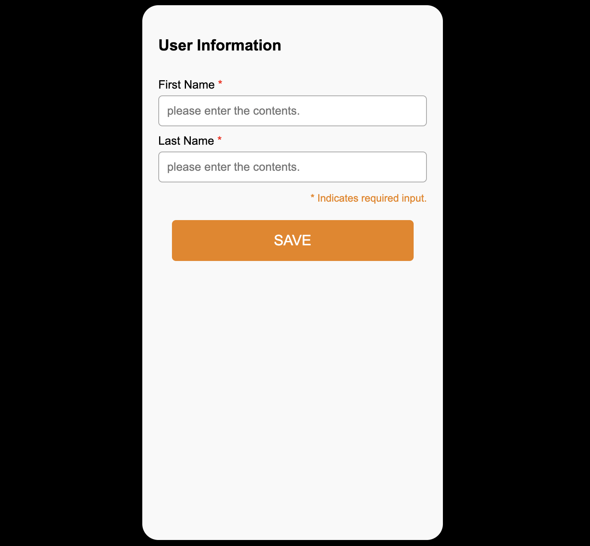
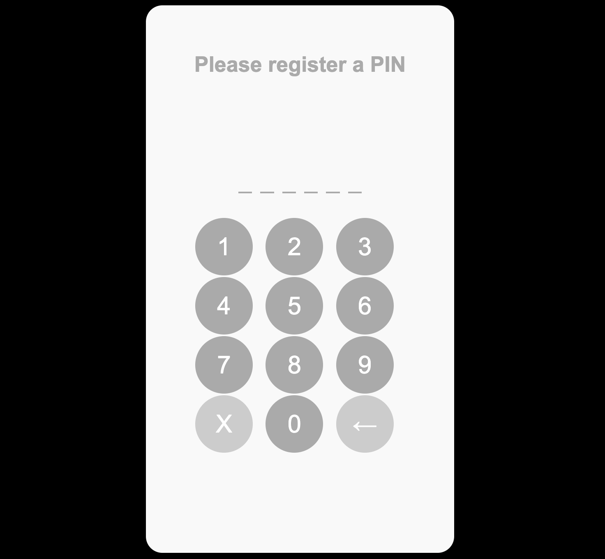

# Demo App 가이드 (V1.0.0.0)
## step1

- 'Open DID Wallet' 화면이 나타나며, 사용자의 등록 과정을 단계별로 안내해 줍니다.  
- 현재 Step 1을 진행 중임을 확인하고, `Next` 버튼을 클릭합니다.
- Step 1은 사용자의 정보입력 후 월렛의 잠금타입을 설정하는 절차입니다.

## user_info

- 'User Information' 화면이 나타나며 사용자의 정보를 입력하게 됩니다.  
- 입력 항목은 `First Name`과 `Last Name`이며, 아래와 같은 용도로 사용됩니다:  
  - 사용자의 PII를 생성할 때 salt로 사용됩니다.  
  - 앱에서 발급받은 VC를 화면에 표시할 때, 사용자의 정보로 출력됩니다.

## lock_popup

- 월렛의 잠금 타입 설정 화면 입니다, 본 데모에서는 지원하지 않습니다.

## step2

- 'User Information' 화면에서 현재 Step 2가 진행 중임을 확인하고, `Next` 버튼을 클릭합니다.
- Step 2는 DID Document 생성 및 인증 수단 등록하는 절차입니다.

## pin_registration

- 서명을 위한 인증 수단으로 사용자의 PIN 등록을 진행합니다.
- PIN 6자리를 등록 후 사용자의 DID Document를 생성합니다.

## finger_popup

- 서명을 위한 인증 수단으로 사용자의 지문 등록을 진행할지 선택하는 팝업입니다. 본 데모에서는 PIN 등록만 지원합니다.

## step3

- 'User Information' 화면에서 현재 Step 3가 진행 중임을 확인하고, `Next` 버튼을 클릭합니다.
- Step 3는 DID Document에 사용자의 서명 후 등록하는 절차입니다.

## pin_authentication

- DID Document 서명을 위하여 사용자의 PIN 입력을 진행합니다.
- PIN 6자리를 입력 후 사용자의 DID Document를 등록합니다.

## main

- 최초 사용자 등록 후에는 발급받은 VC가 없기 때문에  
  `"No certificate has been issued."` 라는 문구가 표시됩니다.
- VC가 발급된 경우에는 **VC 목록**이 화면에 표시됩니다.
- 하단에는 다음 두 개의 버튼이 존재합니다:
  - **ADD VC**: 사용자 주도(User Initiated) 방식으로 VC를 발급합니다.
  - **SCAN QR**: 발급기관 주도(Issuer Initiated) 방식으로 **VC 발급 또는 VP 제출**을 위한 QR 코드를 스캔합니다.

## pin_auth

- 'User Information' 화면에서 현재 Step 2가 진행 중임을 확인하고, `Next` 클릭.

- 'Please register a PIN' 문구가 표시되며 6자리 PIN을 두 번 입력합니다.

- 'Would you like to register additional fingerprints?' 팝업에서 `YES` 클릭.

- 'please input a Lock/Unlock PIN' 문구에 따라 PIN을 두 번 입력합니다.

- 앱 OS에서 지문을 등록하는 팝업이 나타나며, 지문을 입력합니다.
- 'User Information' 화면에서 Step 3가 진행 중임을 확인하고 `Next` 클릭.

- 'Please input a PIN' 화면에서 6자리 PIN을 입력합니다.

- 앱 OS에서 지문을 입력하여 인증합니다.
- 메인 페이지로 이동하며 'No certificate has been issued.' 문구가 출력됩니다.

### 6.2.1. MDL(Mobile Driver License) VC 발급 테스트
- 웹 브라우저에서 데모 서버 메인 페이지 접속 (http://192.168.1.1:8099/home)

- `Enter Information` 클릭 후, 사용자 등록 시 입력한 정보와 동일하게 입력  
- Identification 정보도 입력

- `Save` 클릭 → 저장된 데이터는 MDL VC 발급에 사용됨
- `VC issuance` 버튼 클릭

- `Issuance of ID card` 클릭 → QR 팝업이 나타남

- `DID CA` 앱 실행 → PIN 입력하여 잠금 해제

- `SCAN QR` 클릭 → 카메라로 QR 스캔

- 'Issuance certificate Information' 확인 후 `OK` 클릭

- 지문 인증 또는 PIN 입력하여 사용자 인증
- 'Success' 문구와 함께 발급 성공, `OK` 클릭

- 메인 페이지로 이동 → 발급된 MDL VC 확인

- MDL VC 클릭하여 상세 정보 확인

- 데모 서버 팝업에서 `Check issuance` 클릭 → 성공 메시지 확인

### 6.2.2. National ID VC 발급 테스트
- `DID CA` 앱 실행 → PIN 입력

- `ADD VC` 클릭

- National ID Plan 선택

- VC 정보 확인 후 `OK` 클릭

- Identification 정보 입력 후 `Save`

- PIN 입력

- VC 발급 성공 → `OK` 클릭

- 메인 페이지에서 National ID VC 확인 및 클릭

- VC 상세 정보 확인

## 6.3. VP 제출 테스트
- 데모 서버 메인 페이지 접속 (http://192.168.1.1:8099/home)

- `VP Submission` → `Submit your ID` 클릭

- 'Submit a certificate' 팝업에서 QR 확인

- `DID CA` 앱 실행 → PIN 입력

- `SCAN QR` 클릭 → 카메라로 QR 스캔

- 'Certificate submission guide' 확인 후 `OK` 클릭

- 인증 방식 선택 후 인증 시도

- 제출 성공 후 `OK` 클릭

- 데모 서버에서 `Submission Complete` 클릭 → 완료 확인 메시지

